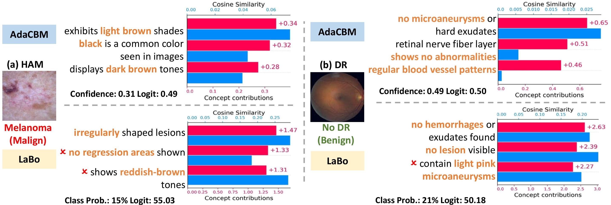

# AdaCBM: An Adaptive Concept Bottleneck Model for Explainable and Accurate Diagnosis

[AdaCBM: An Adaptive Concept Bottleneck Model for Explainable and Accurate Diagnosis, MICCAI 2024](https://dl.acm.org/doi/abs/10.1007/978-3-031-72117-5_4)

Created by Townim Faisal Chowdhury, Vu Minh Hieu Phan, Kewen Liao, Minh-Son To, Yutong Xie, Anton van den Hengel, Johan W. Verjans, and Zhibin Liao

## Introduction

This research addresses limitations in Label-Free Concept Bottleneck Models (CBM) for medical diagnosis by re-examining the CBM framework as a simple linear classification system. Our analysis shows that current fine-tuning modules mainly rescale and shift outcomes, underutilizing the system's learning capacity. We propose an adaptive module between CLIP and CBM to bridge the gap between source and downstream domains, improving performance in medical applications.


## Concepts

We generate the concepts using GPT-4 for each dataset. Our GPT-4 prompt generated concepts are available in the [gpt_concepts](./gpt_concepts/) folder.

## Setup
The code was tested on a single Nvidia RTX A6000 GPU with Python 3.9.13, running Ubuntu 22.04.4 LTS. To install the required packages, use the following command:
```
pip install -r requirements.txt
```

## Directories

Following the structure of [LaBo](https://github.com/YueYANG1996/LaBo/tree/main), the [cfg](cfg/) folder contains the configuration files, while the [datasets](datasets/) folder stores dataset-specific data, including `images`, `splits`, and `concepts`.

## Running the models

We provide the [train.sh](train.sh) script to train the model. A pre-trained model for 10 concepts per class of the HAM10000 dataset is available in the [saved_models](./saved_models/) folder.

## Acknowledgement
This project uses code from the following repository: [LaBo](https://github.com/YueYANG1996/LaBo/tree/main)

## Source

CLIP: https://github.com/openai/CLIP

## Citation

```bibtex
@inproceedings{adacbm,
	title        = {{AdaCBM}: An Adaptive Concept Bottleneck Model for Explainable and Accurate Diagnosis},
	author       = {Faisal Chowdhury, Townim and Liao, Kewen and Minh Hieu Phan, Vu and To, Minh-Son and Xie, Yutong and Hengel, Anton van den and W. Verjans, Johan and Liao, Zhibin},
	year         = 2024,
	booktitle    = {27th International Conference on Medical Image Computing and Computer Assisted Intervention (MICCAI)}
}
```