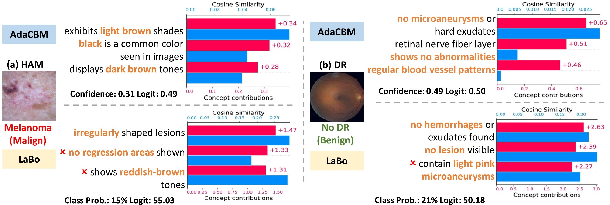

# AdaCBM: An Adaptive Concept Bottleneck Model for Explainable and Accurate Diagnosis


[AdaCBM: An Adaptive Concept Bottleneck Model for Explainable and Accurate Diagnosis, MICCAI 2024](https://www.arxiv.org/abs/2408.02001)


Created by Townim Faisal Chowdhury, Vu Minh Hieu Phan, Kewen Liao, Minh-Son To, Yutong Xie, Anton van den Hengel, Johan W. Verjans, and Zhibin Liao

Code will be available soon

## Introduction

This research addresses limitations in Label-Free Concept Bottleneck Models (CBM) for medical diagnosis by re-examining the CBM framework as a simple linear classification system. Our analysis shows that current fine-tuning modules mainly rescale and shift outcomes, underutilizing the system's learning capacity. We propose an adaptive module between CLIP and CBM to bridge the gap between source and downstream domains, improving performance in medical applications.


## Concepts

For human performance comparison, a senior doctor manually reviewed the three medical tasks and provided 10 concepts for each category, which can be found in the [doctor_concepts](./doctor_concepts/) folder. Additionally, our GPT-4 prompt generated concepts are available in the [gpt_concepts](./gpt_concepts/) folder.


## Citation

```bibtex
@inproceedings{adacbm,
	title        = {{AdaCBM}: An Adaptive Concept Bottleneck Model for Explainable and Accurate Diagnosis},
	author       = {Faisal Chowdhury, Townim and Liao, Kewen and Minh Hieu Phan, Vu and To, Minh-Son and Xie, Yutong and Hengel, Anton van den and W. Verjans, Johan and Liao, Zhibin},
	year         = 2024,
	booktitle    = {27th International Conference on Medical Image Computing and Computer Assisted Intervention (MICCAI)}
}
```